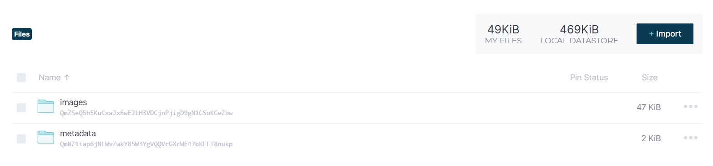
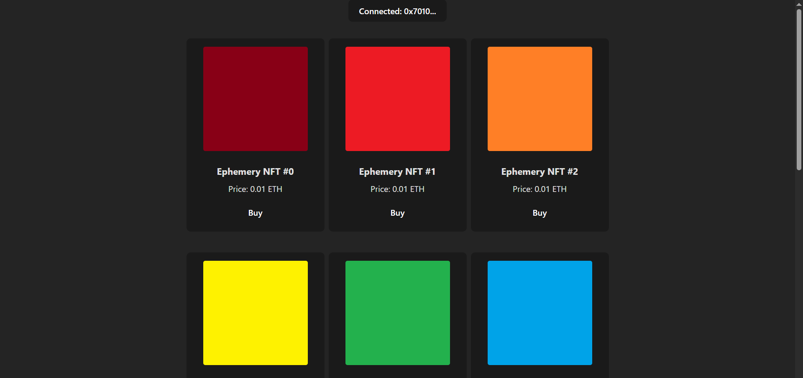
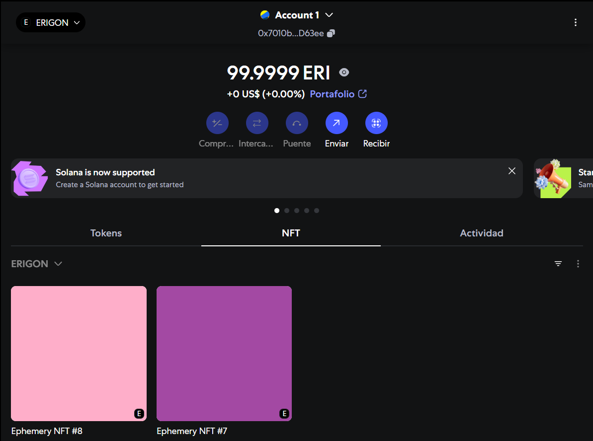

# Mercado Descentralizado de NFTs

Un mercado NFT descentralizado construido sobre la red de pruebas Ephemery de Ethereum, con tokens ERC-721, almacenamiento IPFS y frontend React.

## Pre-Requisitos
- [Node.js](https://nodejs.org/) 
- [npm](https://www.npmjs.com/) 
- [MetaMask](https://metamask.io/) browser extension
    - Agregar red con RPC: https://otter.bordel.wtf/erigon
- [IPFS Desktop](https://docs.ipfs.tech/install/ipfs-desktop/) 
- [Test ETH on Ephemery Testnet](https://github.com/ephemery-testnet/ephemery-resources)
    - Utilizar Faucet: https://ephemery-faucet.pk910.de/
## Pasos a seguir

### 1. Instalar HardHat:
```bash
npm install --save-dev hardhat @nomicfoundation/hardhat-toolbox 
npm install ethers react vite @openzeppelin/contracts
npm install dotenv
npm install @openzeppelin/contracts@4.9.3
```

### 2. Configurar variables de entorno en proyecto/.env y proyecto/web_app/.env:
```bash
PRIVATE_KEY=PRIVATE_KEY_DE_TU_CUENTA
VITE_RPC_URL=https://otter.bordel.wtf/erigon
VITE_CONTRACT_ADDRESS=0x9a460f7e414193F157dd813c44b55dd2eDeB6FBF
```
o puedes desplegar otro contrato con tu cuenta:
```bash
npx hardhat run scripts/deploy.js --network ephemery
```
y colocar la dirección resultante en tus .env en **VITE_CONTRACT_ADDRESS**

También puedes cargar tus NFTs, descargándote IPFS Desktop, dirigiéndote a "FILES" e importando tus archivos. Luego, en los tres puntitos, buscas la opción de "Publish to IPNS" y lo presionas; también dentro de esas opciones podrás encontrar "Copy CID" para poder utilizarlo en breve. Debería quedar así:


Estructura .json con el CID de images:
```bash
{
    "name": "Ephemery NFT #0",
    "description": "",
    "image": "ipfs://CID/0.jpg"
}
```
y modificando en deploy.js la siguiente línea con tu CID de metadata:
```bash
const baseURI = "ipfs://CID/";
```

### 3. Correr app
```bash
cd web_app
npm run dev
```
Ingresando a http://localhost:5173 y conectándote con tu billetera visualizarás algo como:


Al presionar "Buy", MetaMask se desplegará preguntándote si quieres confirmar la compra. Una vez lo hagas, luego de un tiempo aparecerá tu compra en la sección de NFT en tu billetera:


Realizado por: Abigail Mercedes Nuñez Fernandez y Jonathan Sebastian Godoy Silva.