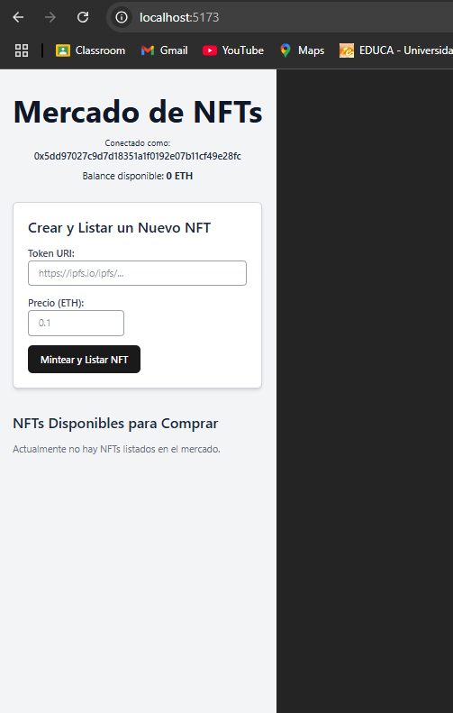

# 🎨 NFT Marketplace - Plataforma de Trading Digital

Una aplicación descentralizada completa para la compra y venta de NFTs, construida con tecnologías Web3 modernas y desplegada en la blockchain Ephemery.

## 🏗️ Arquitectura del Sistema

```
├── smart-contracts/           # Lógica blockchain y contratos inteligentes
│   ├── contracts/            # Contratos Solidity (MarketplaceNFT.sol)
│   ├── test/                 # Suite de pruebas automatizadas
│   │   └── Marketplace.test.js  # Tests del contrato principal
│   ├── deployment/           # Scripts de despliegue automatizado
│   ├── build/                # Artefactos compilados (ABI, bytecode)
│   ├── hardhat.config.js     # Configuración de Hardhat
│   └── .env                  # Variables de entorno
├── frontend/                 # Interfaz de usuario React
│   ├── src/                  # Código fuente de la aplicación
│   ├── vite.config.js        # Configuración de Vite
│   └── .env                  # Variables de entorno del cliente
```

## 🛠️ Stack Tecnológico

- **Blockchain**: Hardhat + Solidity
- **Testing**: Hardhat + Chai + Ethers.js
- **Frontend**: React 18 + Vite + Web3.js
- **Red**: Ephemery Testnet
- **Wallet**: MetaMask Integration

## 🚀 Configuración del Entorno

### Prerrequisitos del Sistema

- **Node.js** versión 18 o superior
- **MetaMask** instalado en el navegador
- **Fondos de prueba** desde [Ephemery Faucet](https://faucet.ephemery.dev)
- **Clave privada** de tu wallet (formato hexadecimal sin prefijo)

## 🧪 Ejecución de Tests

### Instalación de Dependencias de Testing

```bash
cd smart-contracts
npm install --save-dev @nomicfoundation/hardhat-toolbox
```

### Suite de Pruebas Disponibles

Nuestro contrato Marketplace incluye una suite completa de tests que cubre:

- ✅ **Deployment Tests** - Verificación de inicialización correcta
- ✅ **Minting & Listing** - Funcionalidad de minteo y listado de NFTs
- ✅ **Purchase Flow** - Proceso completo de compra con distribución de fees
- ✅ **Withdrawal System** - Sistema seguro de retiro de fondos
- ✅ **Security Tests** - Prevención de ataques y casos límite
- ✅ **Integration Tests** - Flujos completos del marketplace

### Comandos de Testing

```bash
# Ejecutar toda la suite de tests
npm test

# Ejecutar solo tests del Marketplace
npx hardhat test test/Marketplace.test.js

# Ejecutar tests con detalles verbose
npx hardhat test --verbose

# Ejecutar tests con reporte de gas
REPORT_GAS=true npx hardhat test

# Ejecutar tests con coverage
npx hardhat coverage
```

### Resultados Esperados

Los tests verifican aspectos críticos como:

- **Funcionalidad Core**: Minteo, listado, compra y transferencia de NFTs
- **Gestión de Fees**: Distribución correcta del 5% de comisión
- **Seguridad**: Prevención de reentrancy, validaciones de entrada
- **Estados del Contrato**: Verificación de mappings y estructuras
- **Eventos**: Emisión correcta de events en cada operación

## 📦 Despliegue de Contratos Inteligentes

### Paso 1: Preparación del Entorno

```bash
cd smart-contracts
npm install
```

### Paso 2: Configuración de Variables

Crear archivo `.env` en el directorio `smart-contracts/`:

```bash
DEPLOYER_PRIVATE_KEY=tu_clave_privada_aqui
CONTRACT_ADDRESS=# Se actualizará después del despliegue
EPHEMERY_RPC_ENDPOINT=https://otter.bordel.wtf/erigon
ETHERSCAN_API_KEY=opcional_para_verificacion
```

### Paso 3: Validación Pre-Despliegue

```bash
# Compilar contratos
npx hardhat compile

# Ejecutar tests antes del despliegue
npm test

# Desplegar en Ephemery
npx hardhat run deployment/deploy-marketplace.js --network ephemery
```

💡 **Importante**: Siempre ejecuta los tests antes del despliegue para garantizar la funcionalidad del contrato.

### 🎯 Creación de NFTs de Prueba

Personaliza los metadatos en `deployment/mint-sample.js`:

```javascript
const tokenMetadata = {
  name: "Mi NFT Colección",
  description: "NFT de ejemplo para el marketplace",
  image: "https://ipfs.io/ipfs/tu-hash-aqui",
  attributes: [
    { trait_type: "Rareza", value: "Común" },
    { trait_type: "Tipo", value: "Arte Digital" }
  ]
};
const precioEnETH = ethers.utils.parseEther("0.05");
```

Ejecutar el script de minteo:

```bash
npx hardhat run deployment/mint-sample.js --network ephemery
```

## 🌐 Configuración del Frontend

### Instalación de Dependencias

```bash
cd frontend
npm install
```

### Configuración del Cliente

Crear archivo `.env` en `frontend/`:

```bash
VITE_MARKETPLACE_CONTRACT=0x...  # Dirección del contrato desplegado
VITE_EPHEMERY_RPC=https://otter.bordel.wtf/erigon
VITE_CHAIN_ID=39438135
VITE_EXPLORER_URL=https://explorer.ephemery.dev
```

### Lanzar la Aplicación

```bash
npm run dev
```

🌍 **Accede a la aplicación**: http://localhost:5173

## 🧪 Guía de Pruebas del Sistema

### Configuración de MetaMask

1. **Agregar Red Ephemery**:
   - Nombre: Ephemery Testnet
   - RPC: https://otter.bordel.wtf/erigon
   - Chain ID: 39438135
   - Símbolo: ETH

2. **Obtener Fondos de Prueba**:
   - Visita: https://faucet.ephemery.dev
   - Conecta tu wallet
   - Solicita ETH de prueba

### Casos de Prueba End-to-End

- ✅ Conexión de wallet
- ✅ Visualización de NFTs disponibles
- ✅ Compra de NFTs con validación de fees
- ✅ Listado de NFTs propios
- ✅ Retiro de fondos acumulados
- ✅ Historial de transacciones

### Validación de Smart Contracts

Antes de usar el marketplace en producción, verifica que todos los tests pasen:

```bash
cd smart-contracts
npm test
```

**Criterios de Aceptación:**
- ✅ Todos los tests deben pasar (0 failing)
- ✅ Coverage superior al 90%
- ✅ No vulnerabilidades detectadas
- ✅ Distribución correcta de fees (5%)

## 📸 Capturas de Pantalla



## 🔧 Scripts Disponibles

### Backend (Smart Contracts)

```bash
npm run compile    # Compilar contratos
npm run test       # Ejecutar suite completa de tests
npm run test:gas   # Tests con reporte de gas usage
npm run coverage   # Reporte de cobertura de tests
npm run deploy     # Desplegar en Ephemery
npm run verify     # Verificar contratos
```

### Frontend

```bash
npm run dev        # Servidor de desarrollo
npm run build      # Build para producción
npm run preview    # Preview del build
npm run lint       # Linter de código
```

## 🛡️ Seguridad y Auditoría

### Tests de Seguridad Implementados

- **Reentrancy Protection**: Tests para prevenir ataques de reentrada
- **Access Control**: Verificación de permisos y ownership
- **Input Validation**: Validación de parámetros de entrada
- **State Management**: Verificación de estados del contrato
- **Fee Distribution**: Validación matemática de distribución de comisiones

### Mejores Prácticas

- Ejecutar tests antes de cada despliegue
- Mantener coverage de tests superior al 90%
- Revisar logs de gas usage para optimizaciones
- Validar funcionamiento en testnet antes de mainnet

## 🤝 Contribuciones

Las contribuciones son bienvenidas. Por favor:

1. Fork el repositorio
2. Crea una rama para tu feature (`git checkout -b feature/nueva-funcionalidad`)
3. **Ejecuta los tests** (`npm test`)
4. Asegúrate de que todos los tests pasen
5. Commit tus cambios (`git commit -m 'Agregar nueva funcionalidad'`)
6. Push a la rama (`git push origin feature/nueva-funcionalidad`)
7. Abre un Pull Request

### Guidelines para Tests

- Agrega tests para cualquier nueva funcionalidad
- Mantén el coverage de tests superior al 90%
- Incluye tests de casos límite y validaciones de seguridad
- Documenta el propósito de cada test claramente

## 📄 Licencia

Este proyecto está bajo la Licencia MIT. Consulta el archivo `LICENSE` para más detalles.

---

💡 **Tip**: Para una experiencia de desarrollo óptima, ejecuta `npm test -- --watch` durante el desarrollo para tests en tiempo real.