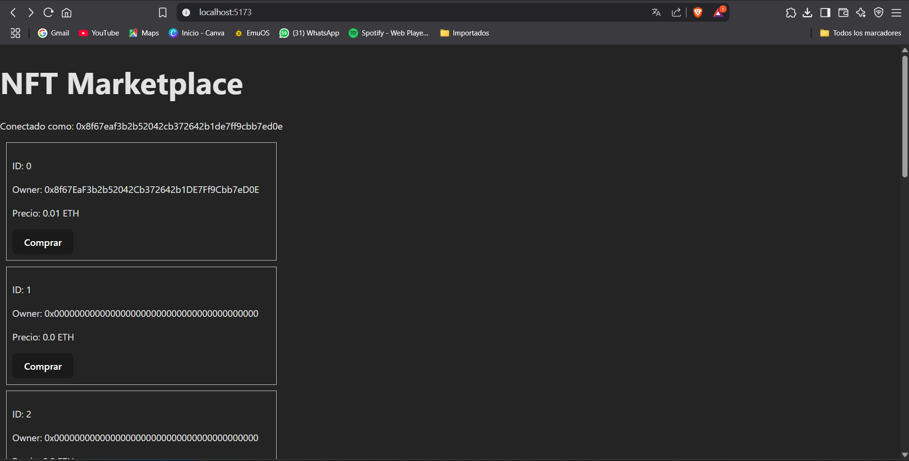
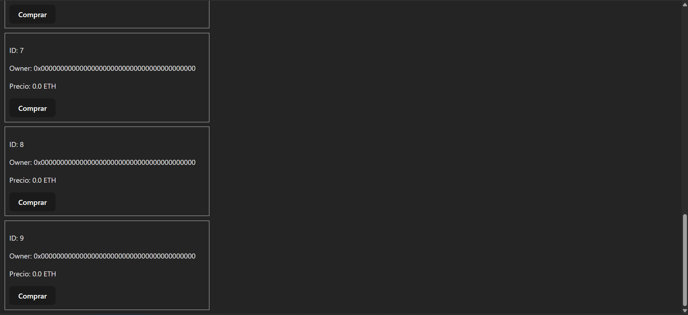

# 🧾 NFT Marketplace DApp

Este proyecto es una DApp de marketplace de NFTs desarrollada con **Hardhat**, **React (Vite)** y desplegada en la red de pruebas **Ephemery**.

---

## 📁 Estructura del Proyecto

├── blockchain-backend # Contratos y scripts de despliegue
│ ├── contracts/ # Smart Contracts (Marketplace.sol)
│ ├── scripts/ # Scripts de deploy y mint
│ ├── artifacts/ # Generado por Hardhat (ABI, bytecode, etc)
│ ├── hardhat.config.js
│ └── .env
├── web_app # Frontend con Vite + React
│ ├── src/
│ ├── vite.config.js
│ └── .env

yaml
Copiar
Editar

---

## ⚙️ Requisitos Previos

- Node.js >= 16
- MetaMask
- Cuenta con ETH de faucet en [Ephemery Faucet](https://faucet.ephemery.dev)
- Clave privada (sin `0x`) de la cuenta (solo para backend)

---

## 🔧 Backend – Contratos

### 1. Instalar dependencias

```bash
cd blockchain-backend
npm install
2. Configurar .env
Crea un archivo .env en blockchain-backend:

ini
Copiar
Editar
PRIVATE_KEY=tu_clave_privada_sin_0x
VITE_CONTRACT_ADDRESS= (se completa luego del deploy)
VITE_RPC_URL=https://otter.bordel.wtf/erigon
3. Desplegar contrato en Ephemery
bash
Copiar
Editar
npx hardhat run scripts/deploy.js --network ephemery
🔁 Copia la dirección del contrato desplegado y agrégala en VITE_CONTRACT_ADDRESS del .env.

🧪 Mintear NFT
Modificá el archivo scripts/mint.js si querés cambiar URI o precio:

js
Copiar
Editar
const uri = "https://mi-nft.com/1";
const price = ethers.utils.parseEther("0.01");
Ejecutá:

bash
Copiar
Editar
npx hardhat run scripts/mint.js --network ephemery
🌐 Frontend – React App
1. Instalar dependencias
bash
Copiar
Editar
cd web_app
npm install
2. Configurar .env
env
Copiar
Editar
VITE_CONTRACT_ADDRESS=0x...   # misma que en backend
VITE_RPC_URL=https://otter.bordel.wtf/erigon
3. Ejecutar la app
bash
Copiar
Editar
npm run dev
Accedé en: http://localhost:5173

🧪 Pruebas
Conectate con MetaMask (cuenta Ephemery).

Si no tenés ETH, usá: https://faucet.ephemery.dev

Podés comprar NFTs minteados desde otra cuenta.

📷 Captura




📜 Licencia
MIT – Este proyecto fue desarrollado con fines académicos y demostrativos.

yaml
Copiar
Editar

---


